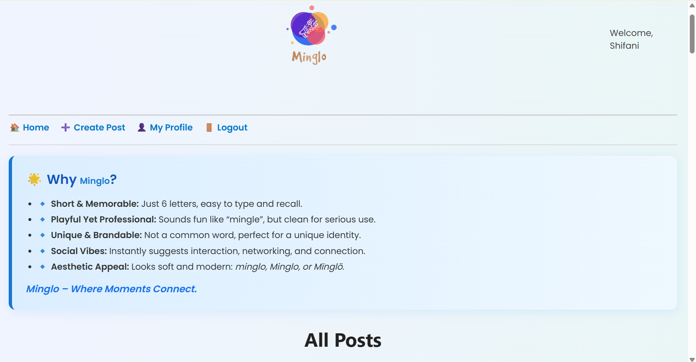
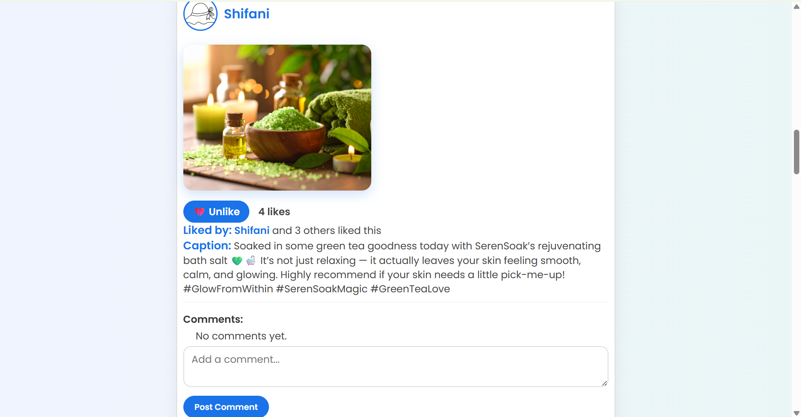
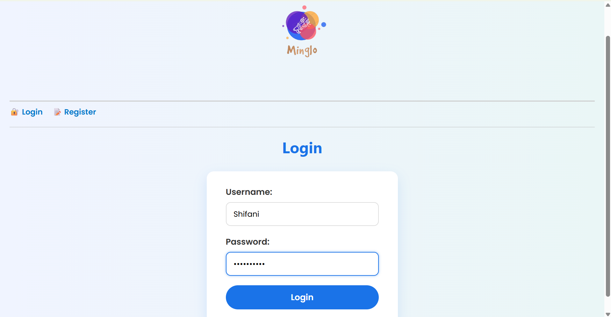
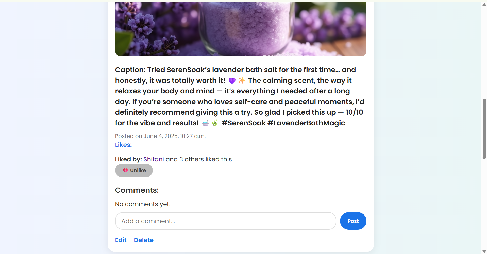
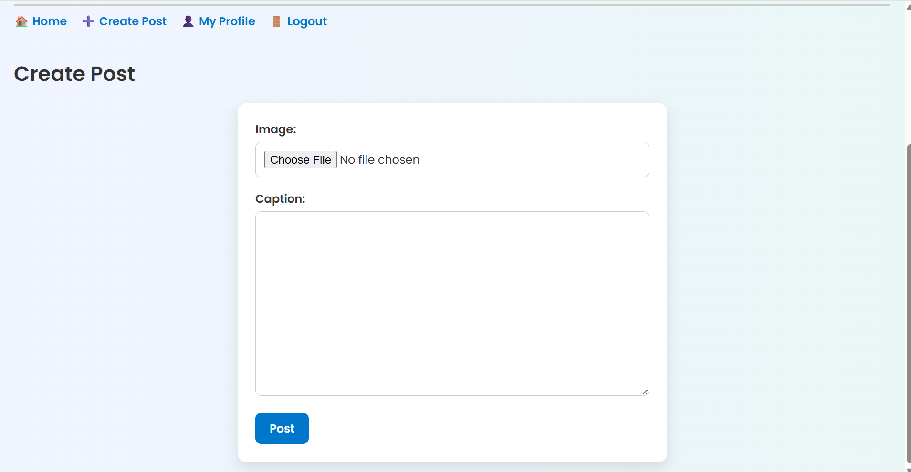
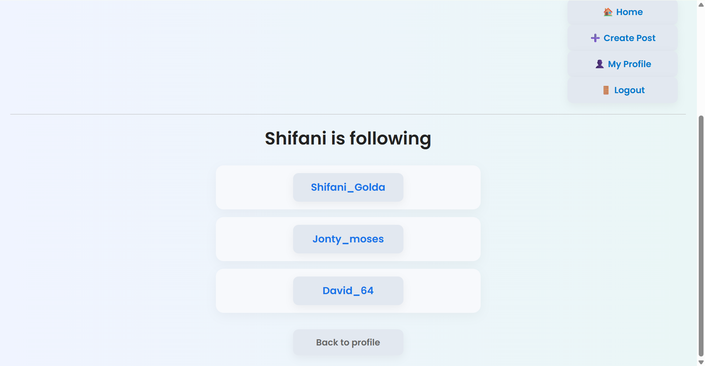

# Minglo - Mini Social Media App

**Minglo** is a creative and lightweight social media platform built as part of my internship project at CodeAlpha. It enables users to register, create posts, like, comment, follow/unfollow others, and manage their profiles. The goal is to deliver a functional and aesthetic experience similar to mainstream social apps, tailored for learning and demonstration purposes.

📛 Why the name "Minglo"?

Minglo is a blend of the words "Mini" and "Glow". The idea is to represent a small, vibrant space that lights up with creativity, thoughts, and connections — a mini glowing social world for everyone to express and interact.

## 📜 Project Description

This project is part of my CodeAlpha Internship, intended to demonstrate my skills in **Full Stack Web Development**, **Django Framework**, **UI/UX design**, **Version Control-Git**.

Minglo is a full-stack mini social media platform built using Django. It focuses on simplicity, usability, and core social features:

🔐 Register/Login System

📝 Post Creation with Captions

❤️ Like & 💬 Comment on Posts

👤 User Profiles wth Profile Pic & Bio

➕ Follow/Unfollow

📄 View Followers and Following Lists

🖼️ Upload Images

✏️ Edit Profile , Delete Posts

🧑‍🤝‍🧑 View Other Users

🎨 Attractive UI with Minglo Branding and Logo

✅ Favicon Support 

## ⚙️ Tech Stack

**Frontend**: HTML, CSS, JavaScript

**Backend**: Django (Python)  

**Database**: SQLite

**Tools Used**: Django Admin, Django Templates, Git & GitHub, PyCharm

## 📂 Project Structure

minisocialapp

│

├── socialapp/ # Django App (views, models, urls, templates)
 
│ ├── templates/socialapp/ # HTML templates

│ └── static/ # Static files (CSS, JS, images)

│

├── media/ # Uploaded media (like post images)

├── minglo_logo.png # Custom logo

├── db.sqlite3 # Database

├── manage.py # Django management file

└── README.md # You're reading it!

## Setup Instructions

### 1. Clone the Repository
 
       git clone https://github.com/Shifani-golda/CodeAlpha_Mini-Social-Media-App.git
   
       cd CodeAlpha_Mini-Social-Media-App
### 2. Create Virtual Environment
 
        python -m venv venv
    
  On Windows
   
       venv\Scripts\activate
   
  On Mac/Linux
   
      source venv/bin/activate
### 3. Install Dependencies
 
      pip install -r requirements.txt
### 4. Run Migrations
 
      python manage.py makemigrations
   
      python manage.py migrate
### 5. Create Superuser (Optional for admin panel)
 
      python manage.py createsuperuser
### 6. Start Development Server
 
      python manage.py runserver

 Now visit: http://127.0.0.1:8000

 ## 📸 Screenshots

 ### 🏠 Home Page
 
 

 
 
 

 ### 🔐 Login Page
 
 

 ### 🔐 Register Page
 
 
 

 

 ### 👤 Profile Page
 
 
 
 

 ### 📝 Create Post
 
 
 

 ### 👯 Following List
 

 ##  Acknowledgments

Thanks to:

CodeAlpha Team

Django Docs

GitHub Community

## Author

D.Shifani Golda

B.Tech CSE (AI & ML), 1st Year

Internship Project - CodeAlpha

## Connect

  GitHub: Shifani-golda

🔗LinkedIn: www.linkedin.com/in/shifani-golda-062028363

✉️Email: shifanigolda@karunya.edu.in

   **💡Minglo lights up every user’s space with creativity and connection**
   
   
